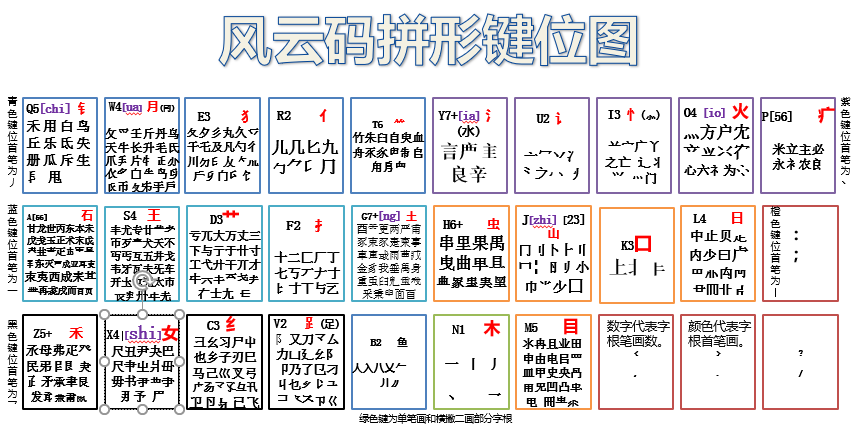

# 欢迎学习风云整句

风云整句，媲美智能双拼的整句输入法！准确率高达98%！

## 历史背景

<!-- ```md -->
本人曾经学过五笔，由于不能忍受五笔的无理拆分，就谋生了自己制作输入法方案的想法。

我曾经制作过天马输入法方案，虽然没有五笔那些无理拆分，指标也优于五笔，但是总觉得离自己理想的方案还差点什么。

在制作天马方案的过程中，我接触了很多优秀的方案。有郑码，山人输入法，当时的天马也是受到了他们双编码的影响，后来听说大神蓝落萧发明了自动拆分系统，输入界又出现虎码，宇浩输入法等优秀的方案。

于是就想利用自动拆分系统重新做一个自己心中酝酿已久的方案，因为没有自动拆分系统，用电子表格费时费力，所以一直没有做，随着自动拆分系统的不断完善，这个方案也逐渐完成。起名风云码拼形输入法。

风云码拼形输入法是一款形码加全拼的输入法方案。其特点是字根用定义的方式选取，字根分布规律性强，按结构自然拆分汉字，全拼作为直接辅助码。采用不定码长的方式输入，真正做到了易学与低重相结合的方案。
<!-- ``` -->

## 必备知识

汉字笔画，一（横）丨（竖）丿（撇）丶（捺）乙（折）五种。

笔画间的关系分为相连，相交，相离。两个同向或反向笔画间有间隙，则称相离；两个笔画间有非端点的公共点，则称相交；否则称相连。

汉字结构：

    1.「上下结构，上中下结构」，

    2.「左右结构，左中右结构」，

    3.「上三包结构，下三包结构，左三包结构，左上包结构，右上包结构，左下包结构，全包围结构」，

    4.「重叠结构」。

汉语拼音，zh，ch，sh分别用j，q，x代替。ia，ua，io，va分别用y，w，v，o代替。ng用g代替。ü和u区分，ü用v代替，zhi chi shi的 i 省略。

## 字根的定义

字根：根据汉字结构和组字频率等不宜再拆分的笔画块。

如「相」，按左右结构分成「木」「目」，而木按结构不能再分，所以木是字根。「鱼」虽然按结构可以拆分，但由于鱼的组字频率非常高，不宜再拆分，所以鱼也是字根。

## 字根的分类

键首字根，构字频率极高，共26个。

「日月金木氵火土，山石王禾纟艹，虫鱼女讠犭疒，亻口忄目扌」口诀：日月金木水火土，山石王丝禾草竹，虫鱼反犬女言病，人口竖心目手足。

衍生字根，由一个结构块和一个单笔画连接而成。由于单笔画不好界定结构方式，所以这种部件作为衍生字根。衍生字根个数不定。如「个亏兀尺玉主勺」等。注意：「旧旦乞」等不是字根。

对称字根，笔画成左右或上下对称。这类字根虽然可以按结构拆分成两个字根，但是拆分出来的一部分构字频率很低，所以不再拆分直接作字根。对称字根个数不定，如「癶，卝」等。

基本字根，根据汉字结构拆分出来的其它字根。数量不定。

## 字根的键位分布

键首字根，每个键位一个，排在该键所有字根的首位。

其它字根据首笔和笔画数分类安排在26个键位上。

少数几个字根为了离散和用指平衡乱序分布。具体规则如下：

```md
FDSAG分别安排横起笔且笔画数是234「56」及7画以上的字根。6画字根在A键。

JKLMH分别安排竖起笔且笔画数是2345及6画以上的字根。K上的字根除了竖横开头和口，其它的在J上。

REWQT分别安排撇起笔且笔画数是2345及6画以上的字根。其中R上只有撇竖和撇折的字根，其它两画字根在B上。

UIOPY分别安排点起笔且笔画数是234「56」及7画以上的字根。6画字根在P键。

VCXZ分别安排折起笔且笔画数是234及5画以上的字根。

N键安排「一丨丿丶乙」单笔画。
```

特例：女在X键，氵水在Y键，山在J键,木在N键，扌手在F键，（足旁）在V键，（竖心）在I键 ，冃在W键。土在G键。禾在Z键.

具体键位图如下：



到了这一步，就可以打一些词语了。

打词语时，每个字根打一码，一个字最多打三个编码。

试试打，你好，谢谢，对不起。等等，好像对不起不会打，没有关系，因为「不」是字根，字根的编码还没有说呢。字根在词语中要打两码。下面说说单字的编码。

## 汉字的编码

单笔画的编码，第一码输入笔画所在键位字母，第二码输入笔画拼音对应首字母。

接着顺次输入笔画读音字母（成字的输入字的拼音字母，不成字的有多个音节的顺次输入每个音节的声母）。

如，「一」：NHYI，「丨」：NSXU，「丿」：NPPIE「乙」：NZYI。乚:NZXWG 「X=sh」


字根的编码，常用成字字根，第一码输入字根所在键位字母，接着输入拼音对应键位。

非常用成字字根，第一码输入字根所在键位字母，接着输入末笔画第二码，最后顺次输入字根第二三笔画的第二码对应字母。

如，常用字「九」：VJIU，JIU是字根读音对应字母。非常用字「戋」:ANHZ。

## 多根字的编码

顺次输入各字根的第一码，然后输入辅助码。

辅助码

第一字根称为首根，最后一字根称为末根。

若首根是键首字根，则补打该字的字音对应字母。不认识的字可以补打末根的第二码。

若首根不是键首字根，则先补打该字的首根第二码对应字母，再补打该字的字音对应字母。不认识的字可以依次补打首次末根的第二码。

## 词语的编码

构词码，单字根字和二字根字，前两码作构词码，三根以上的字前三码作构词码。

顺次输入多字词各字的构词码作为词语的编码。

## 简码

单字，只输入单字前几码就出现在首选位置，则输入的前几码就是单字的简码。

词语，只输入词语前几码就出现在首选位置，则输入的前几码就是词语的简码。

## 整句输入

整句输入时单字一般输入二三码，词组按构词规则输入。

## 汉字的拆分

对于大多数汉字来说，都可以按结构间隙拆分。但是部分字由于字根间没有明显的间隙，而且有不止一种拆法，就必须要有一些拆分规则。

如：「卡」=「上卜」或「{卢上}下」，就会对应不同的编码。

## 拆分规则

结构完整，指合体字拆分必须符合汉字结构。当有多种拆法时各部分要成字优先。如因字要拆成囗大，会拆人云，卡拆上卜。

少弱字根，当符合前面规则仍有多种拆分时，则选择单笔画少的拆分。如卞=1.「亠卜」｜2.「“丶”下」，第一种符合少弱字根，拆分出来没有单笔画。

连续笔顺，当符合前面规则仍有多种拆分时，则选择符合笔顺多的拆分 。

根少优先，当符合前面规则仍有多种拆分时，则选择字根数最少拆分。

取小优先，当符合前面规则仍有多种拆分时，则选择前面字根笔画少的拆分。如兰=1.「丷三」｜2.「䒑二」，第一种符合取小优先。

虽然规则比较多，但是需要规则的字并不多。另外，还有一个高于拆分规则的字根认同规则，就是相交不拆。凡是相交的笔画块都作为字根。

## 拆分编码举例

的=「白勺」QEHDE，们=「亻门」RIMEN

你们=「亻𠂊小亻门」RRKRI，他们=「亻也亻门」RCRI。


## 风云此时交流群

群号：261418302

## 下载地址

入群即可下载
<!-- 下载：http://ziyuan.ysepan.com/ -->