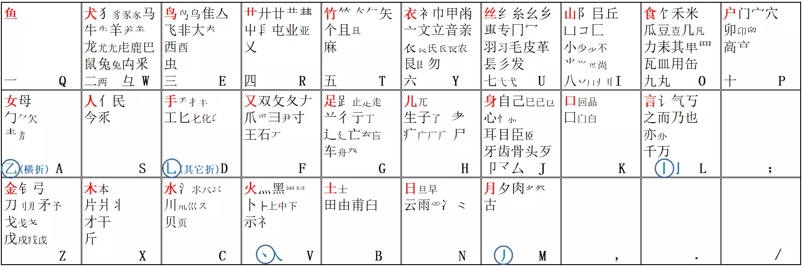

# 欢迎学习字源输入法

字源输入法是以字源为依据归类安排字根，以好学、好用、优美作为最重要的原则设计出的形码类输入法。


## 字根图展示(1.30版)

上排：一二三四五六七八九十

中排：先记两个点（D折、L竖）

下排：金木水火土日月

单独一个字根只剩：Q鱼

V型结构：横折点撇竖（Q-D-V-M-L）



## 简单介绍如何打字

#### @如何出字？

在字源形码中，汉字以（字根 + 全拼）出字，至多四码，其中拼音可以大体上看做是86五笔的识别码

有些难读的字，可以（字根 + 笔画）打出

#### @一字根

【字根 + 全拼 + 全拼 + 全拼 = 字】

例：石（全码——f+shi），fs 给了欢，fsh 为空给了石做简码

#### @二字根

【字根 + 字根 + 全拼 + {‘全拼’} = 字】

例：对（全码——ff+d），高频字，故 ff 给了 对 做简码；二根字只有声母，除非重码才加拼音；

#### @三字根

【字根 + 字根 + 字根 + 全拼 = 字】

例：以（全码——dvs+y），高频字，故 d 给了 以做简码；三根字只有声母；

#### @四字根

【字根 + 字根 + 字根 + 字根 = 字】

例：您（全码——saij），非高频，故 sai 给做简码

#### @字根超过四

【字根 + 字根 + 字根 + 末根 = 字】

例：我（全码——mddv），丿m + 扌d + 乚d （丿 没有） + 丶v

#### @非高频2500字

【字根 + 字根 + 字根 + 笔画 = 字】

【字根 + 字根 + 笔画 + {‘笔画’}= 字】

例：夻（全码——skq），大 + 口 + 一（笔画第一笔）

<!-- **Input**

````md
```js{4}
export default {
  data () {
    return {
      msg: 'Highlighted!'
    }
  }
}
```
````

**Output**

```js{4}
export default {
  data () {
    return {
      msg: 'Highlighted!'
    }
  }
}
``` -->

## 字根练习

**下载中有练习工具，敬请期待页面练字展示……**


## 必知特色(截止1.30)

#### 第一：好学

```md
（１）字根安排以字源为主，方便记忆。
（如：犬、犭、豸、豕、马、牛、羊、虍等放在同一个键上。记到一
个记住一串。）
（２）主字根安排本身极有规律。
（如：“金木水火土日月”依序放在最下面一排键“ZXCVBNM”上。）
（３）识别码用该字拼音，便于人脑直接反应。兼容笔画识别码，生
僻字也轻松打。
（４）二根字、三根字绝大多数有三极简码，不用刻意记。
```

#### 第二：好用

```md
（１）在 GB2312 中需要选重的字仅 7 个：猗、狻、獒、涑、聆、眈、
辶。都是一般情况下用不到的字，或者只会在词中出现的字。
（２）依据人体工程学设计，别扭的指法少，小指用得少，手感非常
舒适。
```

#### 第三：优美

```md
（１）字根安排本身富有哲理，有一种浑然天成的美感。
（２）不安排怪字根、残字根，字根全是规范的汉字偏旁部首。
（３）拆字简单、直观、有规律。
（４）一级简码无特例，全都在它首根的键位上。
```


## 打字详细规则了解

#### 键位图说明

◆ 以下字源解释多数来源于《说文解字》，个别来源于对甲骨文字形的分析。

◆ 没解释的多数是不言自明的，个别是与前面的字根形状相关联的。

```md
１、背字源输入法的字根一定要先背红字根，别的字根都
分别与红字根相关。
鱼犬鸟草竹，衣丝山食户。
女人手又足，儿身口言无（分号键上无字根）。
金木水火土，日月祭今古。

2、字母键三排键分别代表“天、地、人”。
（１）离自己最近的一排键“ZXCVBNM”是“天”类字
根，即五行加日月。
（２）离自己最远的一排键“QWERTYUIOP”是“地”类
字根，即动物、植物、山、衣、食、住。
（３）中间一排键“ASDFGHJKL”是“人”类字根，即
人体自身相关的字根。

3、“一二三四五六七八九十”安排在最上面一排键了。

4、“丨丿丶乚（竖撇点拆）”分别安排在“LMVD”上，皆取象形，便于记忆。
```

#### 字源输入法取码规则

```md
１、单字取码规则
（１）满４字根全取。
如：峰＝山夂三丨＝IFEL
（２）多于４字根取１、２、３、末。
如：丽＝一冂丶冂丶＝一冂丶丶＝QUVV
（３）不满４字根取字根后加该字拼音前几码补满。
如：秀＝禾乃＝OLX 舟＝舟＝GZHO
（二个字根的字绝大多数只要补一个声母就可以了）

１、词组取码规则
（１）２字词取每个字的前两码。
如：字源＝宀子氵厂＝PHCH
（２）３字词取前两个字的第一码和第三个字的前两码。
如：输入法＝车丿氵土＝GMCB
（３）４字词及以上取一、二、三、末字的第一码。
如：宝剑锋从磨砺出＝宀亼钅屮＝PSZR

————难认字笔画识别规则————

笔画识别码就是主键区对应的五笔画：
QLMVD 分别对应“一丨丿丶乙”

一根字取前两笔为识码，二、三根字只取首笔。

如：隹＝EML 訇＝ALM 湛＝CTDV
 (注：以上取码规则仅对 2500 常用字之后的字编码，并全都同时有拼音识别码。)

```

<!-- ```md
::: info
This is an info box.
:::

::: tip
This is a tip.
:::

::: warning
This is a warning.
:::

::: danger
This is a dangerous warning.
:::

::: details
This is a details block.
:::
``` -->


<!-- **Output**

::: info
This is an info box.
:::

::: tip
This is a tip.
:::

::: warning
This is a warning.
:::

::: danger
This is a dangerous warning.
:::

::: details 
This is a details block.
::: -->

## 最新日志

```md
v1.29 - 20241005
这次主要是增加了GBK部分的字，同时增加了一些繁体字根。感谢网友“守平”、“Stranger”、”夢澤閑客”、“天码宋天”、“qq3qq”和“鹤发童颜”提出的宝贵意见，并特别感谢网友“蓝落萧”的拆系统。
1、增加了GBK部分的2万多字，要输入GBK部分的字有以下几种办法：
（1）如果只是临时输入GBK里的字，可以输入引导键“;”后再输GBK字。
（2）可用快捷键Ctrl+m在GBK和GB2312间切换。
（3）直接输入“;GBK”切换到GBK，“;GB”可以切回GB2312。
（4）右键点击状态栏-码表检索-检索GBK。
2、“卵”字的拆法由原来的“丶丿卩丶”调整成了“卩丶”；“民”字的拆法由原来的“コ乙七”调整成了“巳七”。
3、特殊符号、带调拼音、全拼、笔画、临时GBK等全部用分号键引导了。
4、增加了几个命令直通车：（都要用空格或123等确认）
（1）帮助	;bz
（2）键位图	;jwt
（3）GBK	;gbk
（4）GB2312	;gb
5、更新了帮助文档,字根图、拆字规则等都有相应改变。
```

## 彭老师郑重感谢

郑重感谢！（不分先后）网友“雷鸣”、“落羽行歌”、“张太志”、“守平”、“蓝落萧”、“谭淞宸”、“呼呼猪”、“Stranger”、”夢澤閑客”、“朱宇浩”、“天码宋天”、“qq3qq”、“鹤发童颜”、“头目”、“单字234码动态顶功”、“一瞬一瞬一瞬一瞬一瞬一瞬”、“大唐”、“晡时之光”、“峯蕓尒ふ”、以及各位群友用户的建议，使得字源能够更进一步完善！爱你们！

感谢“彭秀峰”对字源的开创！

感谢“雷鸣”在字源前期的鼎力支持！

感谢“张大志”将字源应用于课堂！

感谢“落羽行歌”对字源手机版的创作！

感谢“落羽行歌”对短拼的共创！

感谢“大唐”的输入法内置字源形码！

感谢“大竹”工具及其开发者！

感谢“蓝落萧”男神开发的‘chai’系统拆解字源GBK汉字！

最后再次感谢“蓝落萧”借用的域名！


## 字源交流群

群号：261418302


## 下载地址

永硕E盘：[点这里](http://ziyuan.ysepan.com/ "http://ziyuan.ysepan.com/")